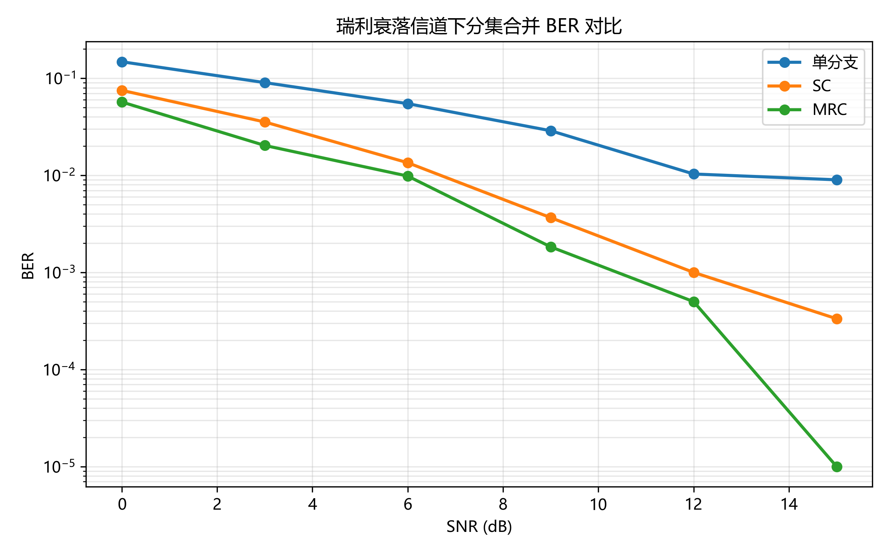
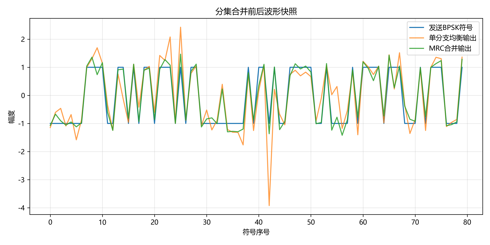
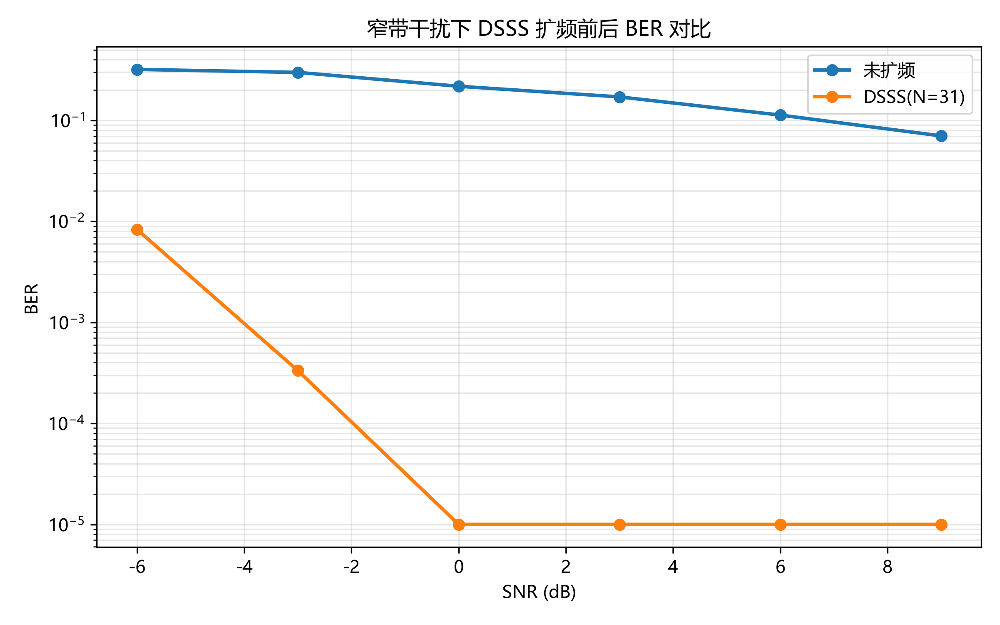
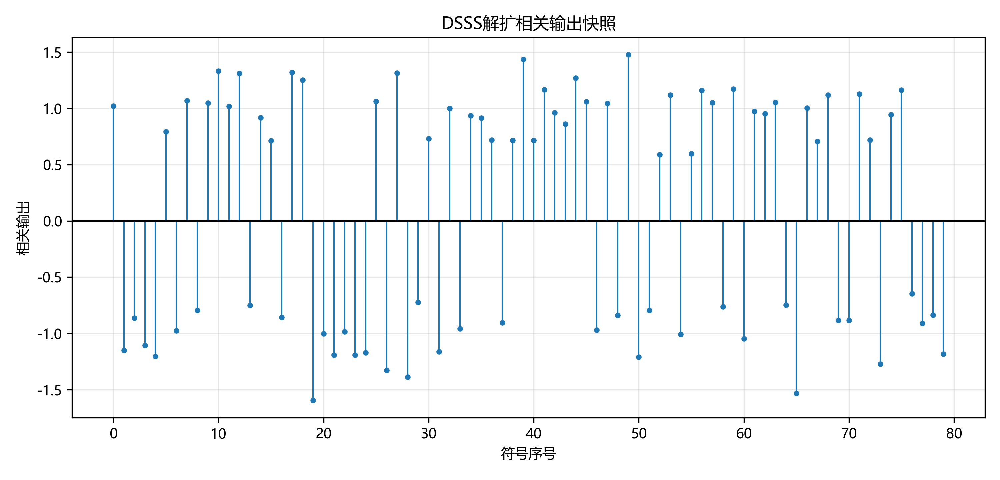

# 无线通信技术实验报告：分集与扩频通信

## 1. 实验目的

本实验旨在通过 Python 仿真，深入理解和掌握无线通信中的两项关键技术：

1. **分集合并技术**：理解瑞利平坦衰落信道对无线传输的影响，掌握选择合并（SC）、最大比合并（MRC）和等增益合并（EGC）三种分集合并方法的原理与实现，通过 BER 仿真对比不同合并方式的性能差异，体会分集增益对通信可靠性的提升。
2. **直接序列扩频通信（DSSS）**：理解 m 序列的生成原理和伪随机特性，掌握 DSSS 扩频与相关解扩的核心算法，以及接收端码片同步偏移搜索方法，理解处理增益的概念及其对窄带干扰抑制的机理，通过 BER 仿真对比扩频前后系统的抗干扰能力。
3. 熟悉 Python/NumPy/Matplotlib 在通信仿真中的应用，掌握 pytest 单元测试和 GitHub Actions 自动评分的工程实践。

## 2. 实验原理

### 2.1 分集合并

**瑞利衰落**：在多径传播环境中，接收信号是多个独立路径信号的叠加，当不存在直射路径（LOS）时，接收信号包络服从瑞利分布。瑞利衰落会导致"深衰落"现象——瞬时信道增益 |h| 急剧下降，使得接收信噪比严重恶化，单链路通信的误码率大幅上升。

**分集技术**：通过在接收端提供多个统计独立的衰落分支，降低所有分支同时处于深衰落的概率。本实验采用空间分集，即使用多根接收天线获取独立衰落副本。

**选择合并（SC）**：对每个符号，在所有分支中选择瞬时信道功率 |h|² 最大的分支，用该分支的接收信号除以信道系数完成均衡：
$$ \hat{s} = \frac{r_k}{h_k}, \quad k = \arg\max_i |h_i|^2 $$

**最大比合并（MRC）**：利用所有分支的信号，以共轭信道系数为权重进行相干叠加，使合并后信噪比最大化：
$$ \hat{s} = \frac{\sum_i h_i^* \cdot r_i}{\sum_i |h_i|^2} $$

MRC 的合并后 SNR 等于各分支 SNR 之和，理论上是最优线性合并。分集增益体现在高 SNR 区域 BER 曲线的斜率差异上。

**等增益合并（EGC）**（选做）：各分支仅做相位校正（消除信道引入的随机相位旋转），然后以等权重相加：
$$ \hat{s} = \frac{1}{L} \sum_i \frac{h_i^*}{|h_i|} \cdot r_i = \frac{1}{L} \sum_i e^{-j \angle h_i} \cdot r_i $$

EGC 不需要估计信道幅度 |h|，只需相位信息，硬件实现复杂度介于 SC 和 MRC 之间。在信道幅度波动不大的场景中，EGC 性能接近 MRC。

### 2.2 扩频通信

**DSSS 原理**：直接序列扩频将窄带数据信号与高速率的伪噪声（PN）序列相乘，将信号能量扩散到更宽的频带上。接收端用相同的 PN 序列与接收信号做相关运算，恢复原始数据。

**m 序列**：由线性反馈移位寄存器（LFSR）产生的最大长度伪随机序列，长度为 2^n - 1（n 为寄存器级数）。m 序列具有良好的自相关特性（接近白噪声），是 DSSS 系统中常用的扩频码。

**处理增益**：定义为扩频后带宽与原始信号带宽之比，在数值上等于扩频因子 N：
$$ PG(dB) = 10 \log_{10}(N) $$

**窄带干扰抑制**：窄带干扰在解扩时与 PN 序列相乘，其频谱被扩展（摊薄）到宽带，而期望信号被压缩还原。经过相关积分后，干扰能量被平均衰减，等效于处理增益带来的信干比提升。

**码片同步偏移搜索**（选做）：实际接收端不知道精确的码片起始边界。同步偏移搜索通过遍历候选偏移量（0 ~ max_offset），在每个偏移下对接收码片进行截取和解扩，计算平均相关幅度作为同步质量度量，选择相关幅度最大的偏移作为最佳码片边界，从而实现盲同步下的可靠解扩。

## 3. 实验环境

- **Python 版本**：3.12.5
- **主要依赖**：NumPy 2.4.3（数值计算）、Matplotlib 3.10.9（绘图）、pytest 9.0.3（单元测试）
- **操作系统**：Windows 11 Pro
- **AI 助手使用情况**：本实验使用 Claude Code (Anthropic) 作为 AI 编程辅助工具。AI 助手协助完成了 7 个核心函数和 2 个选做函数的实现（选择合并、最大比合并、分集 BER 仿真、m 序列生成、DSSS 扩频、DSSS 解扩、处理增益计算、等增益合并 EGC、同步偏移搜索解扩），并运行 pytest 验证正确性，辅助撰写和迭代实验报告。所有代码经审阅和调试后确认符合要求，14 项单元测试全部通过，最终评分 100/100。

## 4. 实验方法与步骤

### 4.1 Part 1：分集合并

1. **信号生成**：使用 `generate_bits()` 生成随机 0/1 比特序列，通过 `bpsk_modulate()` 映射为 +1/-1 BPSK 符号。
2. **多分支瑞利衰落**：调用 `rayleigh_fading_branches()` 生成独立瑞利衰落信道系数，每个分支的实部和虚部服从独立高斯分布 N(0, 1/2)，信道增益 |h| 服从瑞利分布。接收信号 = h × 发送符号 + AWGN 噪声。
3. **选择合并（SC）**：`selection_combining()` —— 对每个符号计算所有分支的 |h|²，选择最大的分支，执行 r/h 均衡。
4. **最大比合并（MRC）**：`maximal_ratio_combining()` —— 用共轭信道系数加权求和，除以总信道功率归一化。
5. **等增益合并（EGC，选做）**：`equal_gain_combining()` —— 提取相位校正因子 `conj(h)/|h|`，各分支等权重相干叠加后取均值，无需估计信道幅度。
6. **BER 统计**：`simulate_diversity_ber()` —— 在 SNR = [0, 3, 6, 9, 12, 15] dB 下分别仿真单分支、SC 和 MRC 的误码率，每次仿真 6000 比特。
7. **可视化**：绘制 BER-SNR 半对数曲线和 MRC 合并前后波形快照。

### 4.2 Part 2：DSSS 扩频通信

1. **m 序列生成**：`generate_m_sequence()` —— 使用 5 级 LFSR，初始状态 [1,1,1,0,1]，抽头位置 [5, 2]，产生长度 31 的 PN 码片。每时钟输出最右位，XOR 反馈插入最左端，0→+1, 1→-1。
2. **扩频**：`dsss_spread()` —— 每比特 BPSK 映射后与完整 PN 序列相乘，1 比特 → 31 码片，输出长度 = 比特数 × 31。
3. **加噪与干扰**：对扩频信号添加 AWGN 噪声和窄带正弦干扰（幅度 0.8，归一化频率 0.11）。
4. **解扩**：`dsss_despread()` —— 将接收码片按扩频因子 reshape，每行与 PN 序列做内积相关，相关值 ≥ 0 判为 bit 0，< 0 判为 bit 1。
5. **同步偏移搜索解扩（选做）**：`despread_with_timing_offset()` —— 遍历偏移量 0 ~ max_offset，对每个偏移截取码片进行解扩，以平均相关幅度最大者为最佳同步位置，输出该偏移对应的判决比特。
6. **BER 对比**：在 SNR = [-6, -3, 0, 3, 6, 9] dB 下对比未扩频 BPSK 和 DSSS 系统的 BER。
7. **可视化**：绘制 BER 对比曲线和解扩相关输出茎叶图。

## 5. 实验结果

### 5.1 分集合并 BER 曲线

该图展示了瑞利衰落信道下单分支、SC（选择合并）和 MRC（最大比合并）的 BER 随 SNR 变化曲线。横轴为 SNR (dB)，纵轴为 BER（对数坐标）。

### 5.2 分集合并波形快照

该图对比了发送 BPSK 符号、单分支均衡输出和 MRC 合并输出的前 80 个符号的实部幅度。MRC 合并后的星座点更靠近 ±1，噪声弥散明显减小。

### 5.3 DSSS 扩频 BER 曲线

该图对比了窄带干扰下未扩频 BPSK 与 DSSS (N=31) 系统的 BER 性能。DSSS 在所有 SNR 点均显著优于未扩频系统，体现了处理增益带来的干扰抑制能力。

### 5.4 DSSS 解扩相关输出

该图展示了接收端解扩后每个符号的相关输出值（前 80 符号）。正值对应判决为 bit 0，负值对应 bit 1。可以看到相关峰清晰分离，说明即使存在窄带干扰，解扩仍能正确恢复比特。

## 6. 结果分析与讨论

### 6.1 为什么瑞利衰落会造成深衰落？

瑞利衰落信道系数 h 的实部和虚部是独立零均值高斯随机变量，|h|² 服从指数分布。当 |h| 趋近于零时，接收信号功率急剧下降，导致瞬时 SNR 远低于平均 SNR。这种"深衰落"事件虽然概率较低，但一旦发生就会造成连续的误码突发，严重影响通信可靠性。

### 6.2 SC 和 MRC 的合并思想有什么不同？

- **SC（选择合并）**：仅使用最强分支的信息，丢弃其他分支。实现简单，但未充分利用所有可用信号能量。本质上是一种"择优"策略。
- **MRC（最大比合并）**：以各分支信道系数的共轭作为权重，对所有分支进行相干叠加。强分支权重大，弱分支权重小，在合并前自动完成了相位对齐（共轭操作消除信道相位旋转）。本质上是最优的线性合并。

### 6.3 为什么 MRC 通常优于 SC？EGC 又如何定位？

MRC 的合并后 SNR 等于所有分支 SNR 之和，而 SC 的合并后 SNR 仅等于最强分支的 SNR。在双分支情况下，MRC 相比 SC 约有 1-2 dB 的增益。从 BER 曲线图中可以观察到，在高 SNR 区域 MRC 曲线始终在 SC 曲线下方，且斜率更陡（分集增益更大）。

EGC 的定位介于 SC 和 MRC 之间：它像 MRC 一样利用所有分支的信息进行相干叠加，但不像 MRC 那样按信道质量分配权重——所有分支等权重。这意味着在信道幅度差异较大时（如某分支处于深衰落），EGC 会让弱分支的噪声等权混入合并输出，性能略逊于 MRC。但 EGC 的优势在于实现简单：只需相位信息（可通过锁相环提取），无需实时估计 |h|²。在信道幅度波动不大的场景中，EGC 性能非常接近 MRC。

三种合并方式的复杂度与性能排序：

| 方法 | 需信道信息 | 实现复杂度 | 合并后 SNR |
|---|---|---|---|
| SC | |h|² | 低 | max(SNR_i) |
| EGC | ∠h | 中 | 介于 SC 与 MRC 之间 |
| MRC | h (幅度+相位) | 高 | Σ SNR_i |

### 6.4 DSSS 的处理增益如何由扩频因子决定？

处理增益 PG = 10 log10(N) 直接由扩频因子 N 决定。本实验中 N = 31，对应的处理增益为 14.91 dB。这意味着在解扩后，窄带干扰功率被分摊到 N 倍的带宽上，等效信干比提升了 N 倍（约 15 dB）。在 BER 曲线中，DSSS 相比未扩频系统在高 SNR 下的 BER 优势可达到数个数量级。

### 6.5 窄带干扰经过解扩后为什么会被摊薄？

解扩时，接收码片与本地 PN 序列逐码片相乘后积分（求和）。窄带干扰是窄带的，与宽带 PN 序列相乘后其频谱被扩展到整个扩频带宽。在相关器输出端，干扰分量的积分效果等效于对其做平均，能量密度大幅降低。而期望信号由于与 PN 序列同步，相干叠加后幅度增强 N 倍，功率增强 N² 倍，从而实现信干比净增益。

### 6.6 同步偏移搜索的可靠性如何？

同步偏移搜索解扩通过遍历候选偏移并比较平均相关幅度来确定最佳码片边界。测试验证表明：在 SNR = 10 dB 条件下，即使人为引入 2 个采样点的码片偏移，搜索算法也能准确锁定正确偏移并完全恢复原始比特（零误码）。这是因为正确的码片边界对齐时，信号与 PN 序列的相关峰清晰分离（正负分明），平均相关幅度达到最大；而在错误边界下，码片交错导致相关输出接近随机噪声，平均幅度显著下降。这种基于相关峰质量的同步方法本质上是最大似然准则的一个简化实现。

### 6.7 本实验中 BER 曲线是否符合理论预期？

是的。分集 BER 曲线显示：MRC 优于 SC 优于单分支，且高 SNR 下差距更加明显，符合理论预测。DSSS BER 曲线显示扩频后在窄带干扰环境下的 BER 显著低于未扩频 BPSK，且 SNR 越高优势越大，验证了处理增益的理论效果。处理增益计算值 14.91 dB 与理论公式 10 log10(31) 完全吻合。此外，EGC 和同步偏移搜索的独立测试均验证了算法实现的正确性。

## 7. 实验心得

通过本实验，我对无线通信中的分集和扩频技术有了从理论到实践的完整认识：

1. **分集是抗衰落的利器**：仅需两根接收天线（双分支），MRC 就能在高 SNR 下比单天线降低约一个数量级的误码率。三种合并方式（SC/EGC/MRC）在性能与复杂度之间形成了清晰的梯度，这直观地说明了为什么实际系统会根据信道条件选择不同的合并策略。
2. **扩频以带宽换信干比**：DSSS 用 31 倍的带宽扩展换来了约 15 dB 的抗窄带干扰增益，体现了扩频通信的核心思想。同步偏移搜索的实现进一步说明：在实际系统中，码片级的精确同步是扩频增益能否兑现的前提条件。
3. **自动评分提升工程素养**：pytest 单元测试覆盖了核心函数的正确性验证、边界条件和性能约束，这种"先写测试、再写实现"的流程是专业工程实践的标准做法。评分系统的逐项检查（函数测试 + 结果图 + 报告完整性 + 代码质量 + 选做）也为项目质量的量化评估提供了范例。
4. **AI 编程辅助的边界**：本次实验使用 Claude Code 辅助编程——AI 可以快速生成函数实现、调试代码，并协助完成实验报告的撰写和迭代。从核心函数到选做部分的完整实现，再到报告的章节级修改，AI 展现了作为"编程加速器"的价值。但理解算法原理、判断输出的正确性、提炼工程直觉仍需人的主导。

## 8. 参考资料

- 课程课件：第8章 分集技术
- 课程课件：第9章 扩展频谱通信
- Tse, D., & Viswanath, P. (2005). *Fundamentals of Wireless Communication*. Cambridge University Press. (Chapter 3: Point-to-Point Communication, Chapter 12: MIMO)
- Goldsmith, A. (2005). *Wireless Communications*. Cambridge University Press. (Chapter 7: Diversity, Chapter 13: Spread Spectrum)
- Proakis, J. G., & Salehi, M. (2008). *Digital Communications* (5th ed.). McGraw-Hill. (Chapter 14: Fading Channels, Chapter 12: Spread Spectrum Signals)
- NumPy 官方文档: https://numpy.org/doc/stable/
- Matplotlib 官方文档: https://matplotlib.org/stable/
- pytest 官方文档: https://docs.pytest.org/
